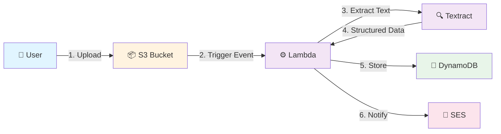

# AWS Receipt Processing System

[](https://github.com/subhamay-bhattacharyya/aws-receipt-processing-system)&nbsp;[](https://github.com/subhamay-bhattacharyya/aws-receipt-processing-system)&nbsp;[](https://github.com/subhamay-bhattacharyya/aws-receipt-processing-system/issues)&nbsp;[](https://github.com/subhamay-bhattacharyya/aws-receipt-processing-system/commits)

[](https://aws.amazon.com/cloudformation/)&nbsp;[](https://aws.amazon.com/lambda/)&nbsp;[](https://aws.amazon.com/textract/)&nbsp;[](https://aws.amazon.com/dynamodb/)&nbsp;[](https://claude.ai/)

---

## Overview

An automated receipt processing pipeline that ingests receipt images/PDFs, extracts structured data using ML, and stores results with email notifications. Built entirely with Infrastructure-as-Code using CloudFormation nested stacks for modularity and reusability across environments.

---

## Architecture



---

## Features & Status

| Component | Purpose | Status |
| --- | --- | --- |
| **S3 Bucket** | Stores receipt images/PDFs with versioning & encryption | ✅ Complete |
| **DynamoDB Table** | Stores extracted receipt metadata | ✅ Complete |
| **Lambda Function** | Orchestrates receipt processing workflow | 🔲 Pending |
| **Textract Integration** | Extracts text/data from receipts | 🔲 Pending |
| **SES Notifications** | Sends email with extracted details | 🔲 Pending |
| **IAM Roles & Policies** | Cross-service permissions | 🔲 Pending |

---

## Project Structure

``` text
.
├── cloudformation/
│   ├── template.yaml                # Root CloudFormation stack
│   ├── parameters.json              # Stack parameters
│   └── stack-config.json            # Stack configuration
├── .github/
│   ├── workflows/
│   │   ├── ci.yaml                  # Validation & deployment
│   │   ├── release.yaml             # Semantic versioning
│   │   ├── claude.yaml              # Claude Code integration
│   │   └── create-branch.yaml       # Issue-based branch automation
│   ├── CODEOWNERS                   # Repository ownership
│   └── PULL_REQUEST_TEMPLATE.md     # PR template
├── scripts/
│   └── plugins/
│       ├── release.config.js        # Semantic-release configuration
│       ├── analyze-commits.js       # Commit analysis
│       ├── generate-notes.js        # Release notes generation
│       └── (other plugins)          # Release automation scripts
├── .claude/
│   ├── settings.json                # Claude Code workspace settings
│   └── .skills/                     # Custom skills
├── .env/
│   └── environments.yaml            # Environment configuration
├── CLAUDE.md                        # Project guidelines
├── CONTRIBUTING.md                  # Contribution guidelines
├── CHANGELOG.md                     # Version history
├── PROGRESS.md                      # Implementation tracking
├── CODE_OF_CONDUCT.md               # Code of conduct
├── LICENSE                          # MIT License
└── README.md                        # This file
```

---

## Key Features

### Infrastructure as Code

- Nested CloudFormation stack pattern for modularity
- Parameter-driven multi-environment configuration
- Deterministic resource naming (ProjectName-Environment-AccountId-Region)

### Security Best Practices

- S3 versioning and public access blocking
- KMS encryption for S3 and DynamoDB
- DynamoDB point-in-time recovery
- IAM least-privilege access patterns

### CI/CD & Automation

- GitHub Actions validation and deployment
- AWS OIDC keyless authentication
- Semantic versioning with conventional commits
- Automated CloudFormation template validation

---

## Next Steps

1. Create Lambda function CloudFormation template
2. Integrate Amazon Textract for OCR
3. Configure SES for email notifications
4. Define IAM roles and cross-service policies
5. Set up DynamoDB Streams to Lambda integration

---

## Contributing

See [CONTRIBUTING.md](CONTRIBUTING.md) for guidelines.

---

## License

MIT
